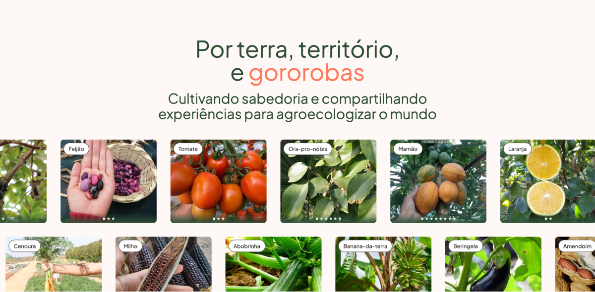
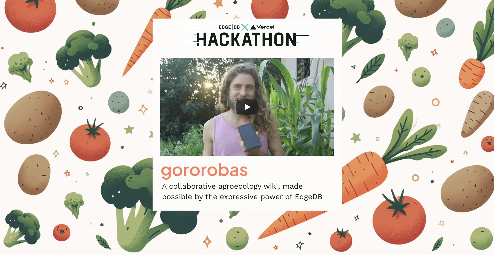

# Gororobas, collaborative agroecology wiki



✨ The app is live at: https://gororobas.com

This is a Typescript project built leveraging the following technologies:

- [Gel](https://geldata.com): database and authentication
- [NextJS](https://nextjs.org) and [React](https://react.dev/): frontend frameworks
- [Vercel](https://vercel.com): deployment
- [TailwindCSS](https://tailwindcss.com), [RadixUI](https://www.radix-ui.com/) and [Shadcn/UI](https://ui.shadcn.com/): styling and component primitives
- [Effect](https://effect.website): typescript tooling for more robust and type-safe code
- [OpenTelemetry](https://opentelemetry.io) and [Honeycomb](https://honeycomb.io): observability
- [Sanity.io](https://sanity.io): image storage and CDN
- [Mailpit](https://mailpit.axllent.org/docs/install/): email server for local development
- [Tiptap](https://tiptap.dev): rich text editor
- [react-hook-form](https://react-hook-form.com): form state management
- [dnd-kit](https://dndkit.com): drag and drop for lists in form
- [pnpm](https://pnpm.io): package manager
- [Biome](https://biomejs.dev): linter and prettifier
- [lint-staged](https://github.com/lint-staged/lint-staged) and [husky](https://typicode.github.io/husky/): pre-commit hooks to ensure everything is OK
- [Bun](https://bun.sh): Javascript runtime for faster local development

## Introduction to the project



You can learn about the project's motivation, tech stack, approach and learnings here: https://gororobas.com/hackathon

## Developing locally

1. Start by populating the `.env.example` file with the necessary environment variables. You can copy it to `.env.local` and fill in the values.
   - If you're connected to the Vercel project, you can use `vercel env pull` to build the production `.env` file.
1. In order to authenticate with emails locally, you need to install and run [Mailpit](https://mailpit.axllent.org/docs/install/). This will allow the Gel server to send emails via your local Mailpit server.
   - 💡 You can still authenticate with Google oAuth without it
1. To connect to a local database, [install Gel](https://docs.geldata.com/learn/cli#installation) to your machine
1. Run `pnpm install` to install the dependencies
1. In a separate terminal, run `gel project init` to start an Gel instance for the current config
1. Run `gel ui` to open the Gel Studio
1. Then, in the same Gel terminal, run `gel watch` to have it watch changes to your schema
1. After Gel has applied the necessary migrations, run `bun run generate:all` to have the types and our custom EdgeQL SDK generated. This is necessary to interact with the database and the project won't run without it.
1. After generating types, run `bun run auth:setup` to configure Gel with the proper authentication settings
1. Finally, run `bun run dev` to start the development server and access the app at `http://localhost:3000`

## Deploying the app and database

1. Log into Gel Cloud in your terminal with `gel cloud login`
1. Migrate the current database schema to the cloud with `gel migrate -I ORG/INSTANCE_NAME`
1. If you're starting a new cloud instance, you can seed it with a local dump of data with:
   ```sh
   gel dump <your-dump.dump>
   gel restore -I <org>/<instance-name> <your-dump.dump>
   ```
1. If you're setting up a Vercel project for it the first time, refer to the [official guide on deploying to Vercel](https://docs.geldata.com/guides/tutorials/nextjs_app_router#deploying-to-vercel)
1. When you push a commit to main, Vercel will automatically build and deploy it to `gororobas.com` or whatever the domain for the new project you've set up

## Working with translations

We're using the [Inlang suite of tools](https://inlang.com) to manage translations and locale selection. Its big benefit is its compiled nature, which makes bundle sizes more atomic and allows us to use the same API for translation strings no matter where they're at - components, APIs, constants and more, all call each translation string's individual function, compiled by [ParaglideJS](https://www.npmjs.com/package/@inlang/paraglide-js).

**🌺 to edit translations**, we highly recommend you to install the [Sherlock VSCode extension](https://inlang.com/m/r7kp499g/app-inlang-ideExtension) to edit and preview translation strings inline. The alternative is editing the `messages/pt|es.json` files, but that's more cumbersome.

## Credits

People involved in this creation:

- [henrique doro](https://hdoro.dev) - design and development
- [angie cepeda](https://www.instagram.com/angiedeandes/) - content and photography
- Daniel Mundim Porto Pena - for his work on [Sistematização e planejamento de sistemas agroflorestais no bioma Cerrado](https://repositorio.ufu.br/handle/123456789/30942), which we used to populate a subset of the database

## Contributing

If you'd like to contribute to the project, please open an issue or a pull request. We're open to suggestions and improvements but aren't sure how they'll pan out yet 🙂

## License

This project is licensed under the Apache 2.0 License. You can read more about it in the [LICENSE](./LICENSE) file.
